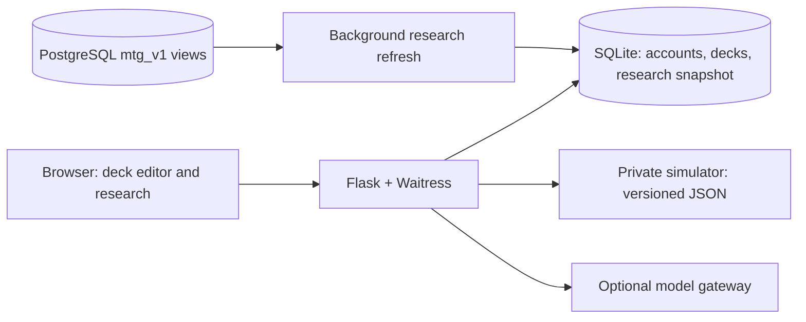

# Deck Lab

[](https://github.com/DylnMtthws/deck-lab/actions/workflows/ci.yml)
[](LICENSE)

**Build, research, and test competitive Commander decks in one workspace.**

[Live application](https://decklab.studio) · [Architecture](docs/architecture.md) · [Development](CONTRIBUTING.md) · [Deployment](docs/deployment.md)

Deck Lab is a Python/Flask application for turning Magic: The Gathering card and
tournament data into practical deckbuilding decisions. Users can edit a deck,
research the competitive metagame, inspect card information, and run goldfish
simulations. Saved decks, accounts, and user preferences persist across sessions.
The hosted application requires an owner-provisioned account.

This project grew out of an AI deck generator. That original product now lives
in [Commander Deck Generator](https://github.com/DylnMtthws/commander-deck-generator).
Deck Lab focuses on an interactive research and editing workflow.

## Engineering highlights

- **Responsive research over a changing corpus.** Public research results use a
  persisted snapshot, revision tracking, background refresh, and bounded stale
  serving. Filters and browser history update without rebuilding the whole page.
- **Deterministic domain logic.** Commander legality, color identity, partner
  combinations, and deck size are validated in code. The strategy-pack builder
  selects cards deterministically; model output adds explanation through a
  separate validated boundary.
- **Explicit data contracts.** PostgreSQL research comes through versioned
  `mtg_v1` views with a read-only consumer. A separate simulator exchanges
  versioned JSON validated against a packaged schema. Missing evidence and
  unavailable simulations are visible states rather than invented results.
- **Security across the application lifecycle.** Argon2 password hashes, CSRF
  protection, account provisioning, password recovery, and authorization checks
  protect saved user data. Production and QA have separate credentials, data,
  and container networks.
- **Reproducible releases.** GitHub Actions gates tests, lint, formatting, types,
  and container smoke checks. Deployment verifies the tested image's revision,
  archive hash, platform, and layers. Encrypted backups and isolated restore
  checks support recovery.

## Architecture



The deployment uses Caddy for HTTPS and Docker Compose on DigitalOcean. Public
traffic reaches the web app through the gateway; database and simulator ports
are private. QA is available at `qa.decklab.studio` for owner review before a
production release. See [architecture and tradeoffs](docs/architecture.md).

## Run locally

Requires Python 3.11+. From a fresh checkout:

```sh
git clone https://github.com/DylnMtthws/deck-lab.git
cd deck-lab
python3.11 -m venv .venv
source .venv/bin/activate
pip install -e '.[dev,postgres,legacy]'
python scripts/setup_db.py
export SABER_SECRET_KEY="$(python -c 'import secrets; print(secrets.token_hex(32))')"
export SABER_AUTH_MODE=password
export SABER_DECK_LAB_REDESIGN=1
export SABER_COOKIE_SECURE=0
sabermetrics create-admin --email you@example.com
sabermetrics serve
```

Open `http://127.0.0.1:5000`. The CLI/package retains the historical
`sabermetrics` name for compatibility. The default fixture-backed cEDH path
works without provider credentials, PostgreSQL, or a simulator. Production's
research corpus and private accounts are not distributed with the repository.
See [configuration](.env.example) for optional integration settings and rollout
flags. Never use development cookie settings on a public deployment.

For an offline look at the deterministic builder:

```sh
sabermetrics cedh packs
sabermetrics cedh build --pack kinnan_basalt --out candidate.json
```

## Verification

```sh
pytest -q
ruff check src tests scripts/release_control.py scripts/storage_control.py scripts/storage_remote.py
black --check src tests scripts/release_control.py scripts/storage_control.py scripts/storage_remote.py
mypy src
```

The default suite uses fixtures and mocks. Live PostgreSQL, model, and simulator
integrations are opt-in; model tests can incur API charges. CI also exercises
installed-package behavior outside the source directory, authentication/recovery,
feedback with mocked delivery, and HTTP container startup. The type configuration
records scoped legacy exclusions rather than claiming complete type coverage.

## Code worth reading

| Area | Entry point | What it demonstrates |
| --- | --- | --- |
| Application and auth | [`src/sabermetrics/ui/`](src/sabermetrics/ui/) | Routes, sessions, validation, user-facing failures |
| Research and deck logic | [`src/sabermetrics/cedh/`](src/sabermetrics/cedh/) | Repository boundaries, domain models, deterministic selection |
| Shared persistence | [`src/sabermetrics/db.py`](src/sabermetrics/db.py) | SQLite access and account/deck repositories |
| Contract tests | [`tests/`](tests/) and [`fixtures/cedh/`](fixtures/cedh/) | Offline evidence, schema and regression checks |
| Release validation | [`scripts/release_control.py`](scripts/release_control.py) | Artifact provenance and deployment gates |

## Scope and limitations

This is a Commander-focused application, not a full rules engine. Goldfishing
measures modeled play patterns, not multiplayer win probability. Tournament
coverage reflects available source data; inclusion rate is not proof of card
quality. Strategy-pack support is bounded by curated material and simulator
capabilities. The single-host deployment is a deliberate operational tradeoff,
not a claim of high availability.

Some original generator modules remain as compatibility code and regression
history; its independently deployed product and active entry point are in the
separate generator repository. Historical Fly runbooks are retained as records,
not current deployment instructions.

Contributions: [CONTRIBUTING.md](CONTRIBUTING.md). Vulnerabilities:
[SECURITY.md](SECURITY.md). Licensed under [MIT](LICENSE).

*Unofficial fan project; not affiliated with Wizards of the Coast. Magic: The
Gathering belongs to its respective owners. Card artwork/data retain their
original rights.*
